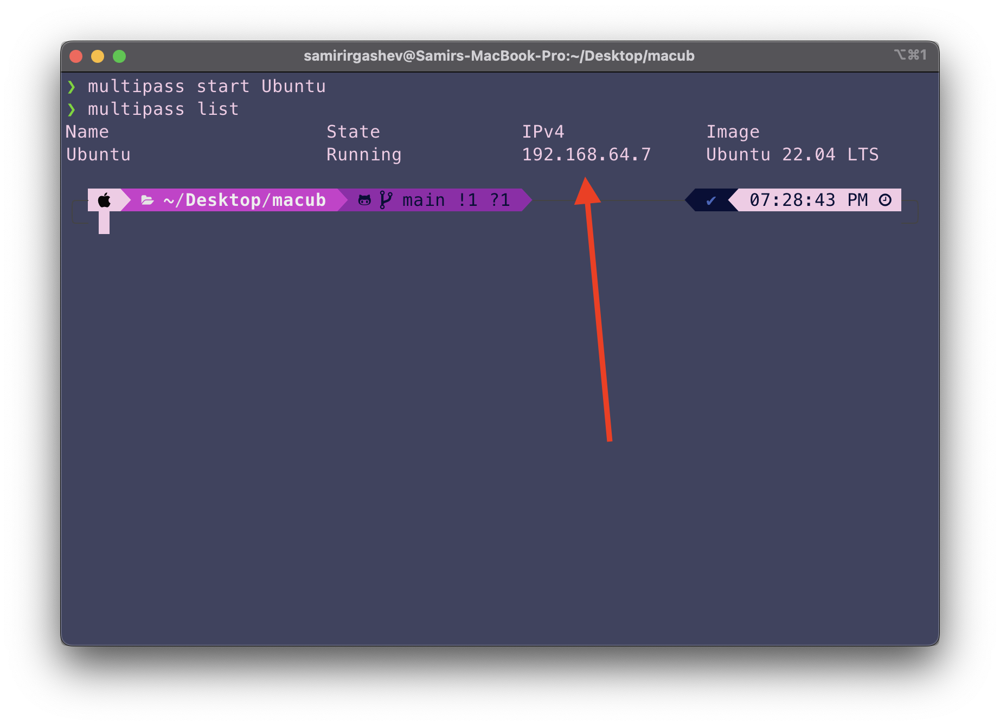
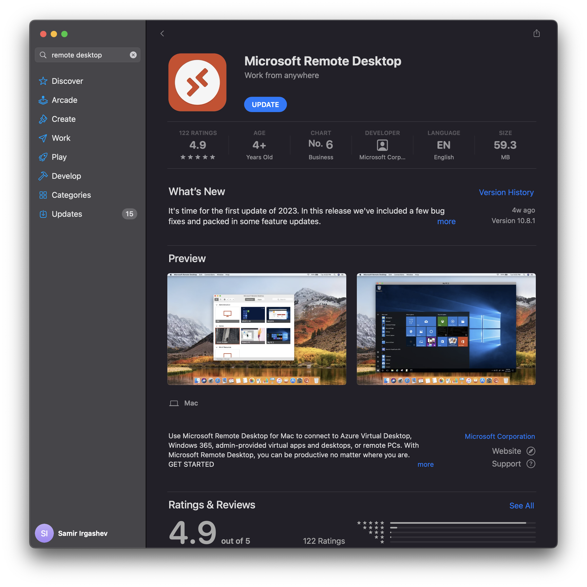
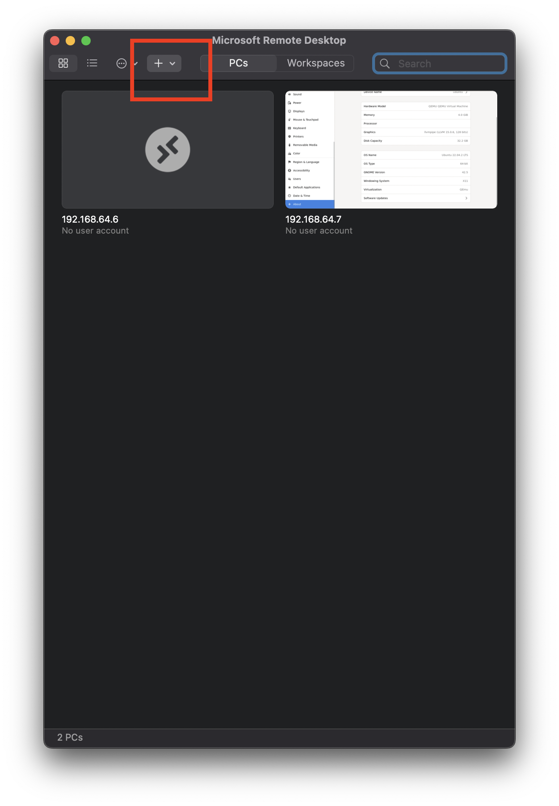
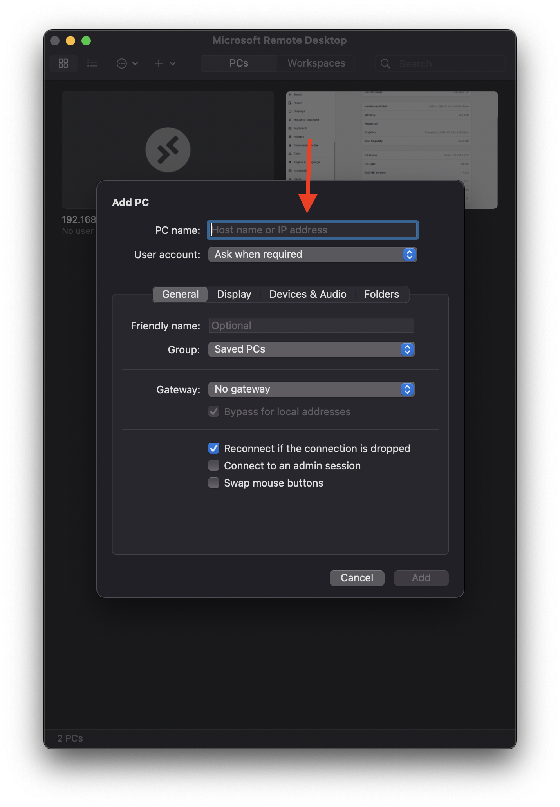
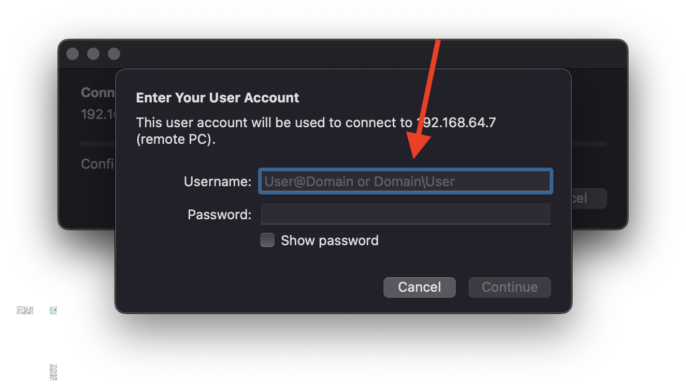

# How to install ubuntu 22.04 on M1 Mac

## Install homebrew

```bash
/bin/bash -c "$(curl -fsSL https://raw.githubusercontent.com/Homebrew/install/HEAD/install.sh)"
```

## Install multipass
```bash
brew install multipass
```

## Create an image instance

```bash
multipass launch 22.04 -n primary -c 2 -m 4G -d 50G
```

-n primary == Name the instance "primary", you can call it whatever

-c == number of cpu's allocated

-m == main memory allocated

-d == amount of disk partition allocated

## Enter the image shell

```bash
multipass shell 
```

## Enter the following command
```bash
sudo apt update
sudo apt install ubuntu-desktop xrdp -y
```

## Add user to the system
```bash
sudo adduser Nigina
sudo usermod -aG sudo Nigina
```
You will be asked to create a password, remember it.

## Getting the ip address

### Open new terminal window and enter the following command

```bash
multipass list
```
### Here you can see the ip address, copy it


## Meanwhile, install Microsoft remote desktop



## Opening the ubuntu

### Add new desktop using this '+' 



### Enter the copied ip address here



### Now enter your login info

Nigina

123456



## Welcome

